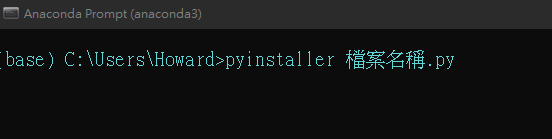
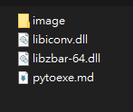
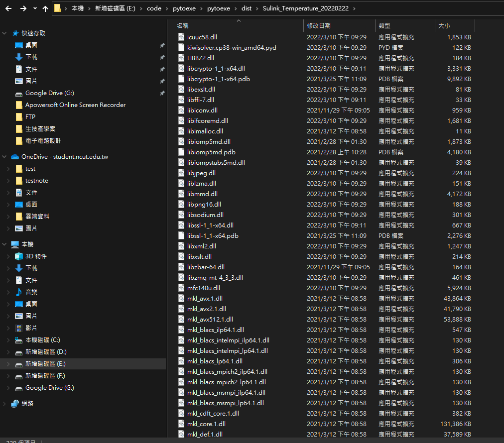

# pyinstaller打包檔案方式
## (1)開啟需打包的檔案的檔案位置
## (2)在anaconda或cmd輸入指令(需先安裝pyinstaller)
安裝pyinstaller指令
```py
pip install pyinstaller
```
打包檔案
```py
pyinstaller "檔案名稱"
```

## (3)當檔案打包完後將檔案還無法使用是因為缺少兩個動態連結檔案



將資料夾下的libiconv.dll和libzbar-64.dll放入dist資料夾下


## (3)重新開起exe檔案便可以成功使用